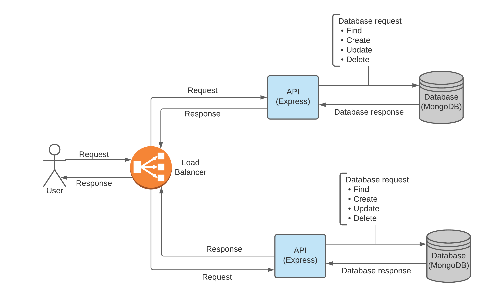
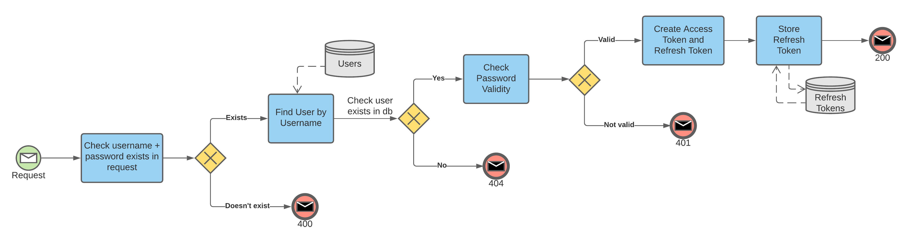
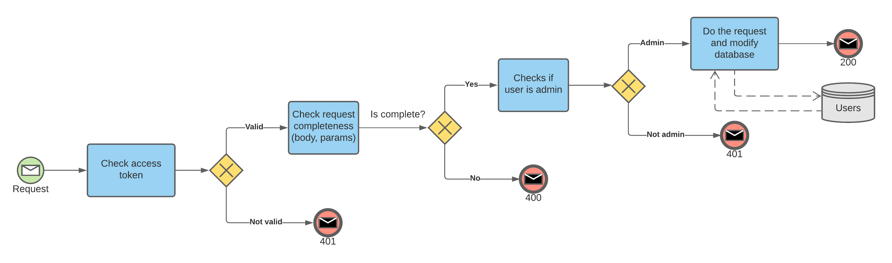
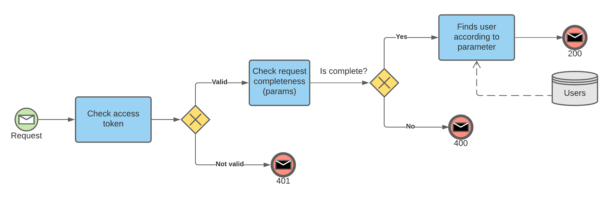
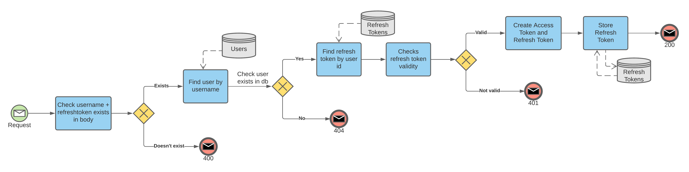

# SimpleApp

## API Documentation
https://documenter.getpostman.com/view/7623074/TVzVibaf

## Admin Credentials
- username: "admin"
- password: "admin"

## Description
A simple user API using NodeJS with Express framework. Data is stored in MongoDB database. This API can handle following tasks:
- login
- create user
- read user
- update user
- delete user
- refresh token. 

Application is deployed on AWS using kops (Kubernetes Operations) and the API can be accessed through [this link](http://a1ce6c5715d3d43f7aae151ca0026319-1256597656.us-east-1.elb.amazonaws.com:3001).

## Diagrams
### Architecture Diagram
Architectural diagram about how the request is sent from user to deployed API.

### Login Process Diagram
Login process diagram flow from request sent by user to response given by system to enable user to log into the system.

### Create, Update, Delete Process Diagram
Diagram for process of creation, update, and deletion of user data. Only allowed for admin role and requires authentication token.

### Read Diagram
Read process diagram given by user to enable user to get informations about all users (based on username or id). Needs an authentication token.

### Refresh Token Diagram
Diagram of process to get a new authentication token to users that have login and the refresh token has not expired. 

